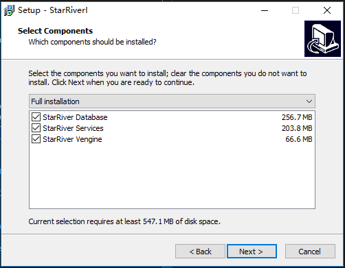

# Installation

StarRiver Server consists of two modules: the database system and the StarRiver communication application.

## System Requirements

Reference the followings to get the hardware and software environment prepared:

- Hardware Requirements
  - Minimum
    - Quad-core CPU: Intel* Core* processor i5 family
    - 8GB RAM
    - Ethernet bandwidth: 100Mbps
  - Recommended
    - Hexa-core CPU: Intel* Xeon* processor E5 family
    - 32GB ECC RAM
    - Gigabit Ethernet

> **Note**: Wired network is highly recommended. A wireless connection may lead to high latency.    

- Software Requirements
  - Minimum: Windows Server 2008
  - Recommended: Windows Server 2012 / Windows 7 or newer with x64
  - Compatible browsers
    - Chrome
    - Firefox
    - Safari
    - Internet Explorer 10
    - Edge


## Install StarRiver

Run `StarRiver_setup.exe` to install the StarRiver system.  Choose to install all of the three component modules of the StarRiver system by selecting `Full installation` with all the modules checked.



## Configuration

Do update the configuration file following the instructions below so that the system would be able to access by http protocol.

For example: to access SartRiver by http://172.16.40.70 using a browser.​	

1. Add your IP address to the `Origins` list in the `CORS` section of the file below.
   `$(install_path)\starriver-service\global.json`

```@json
  "CORS": {
      "Credentials": false,
      "Origins": ["http://localhost", "http://127.0.0.1", "http://172.16.40.70"],
      "Headers": ["authorization"],
  }
```

2. Restart your machine.
