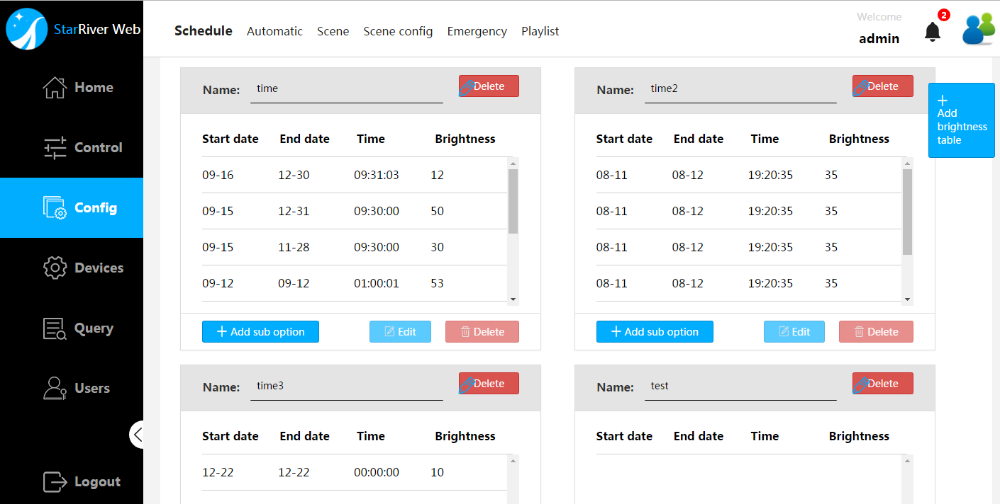
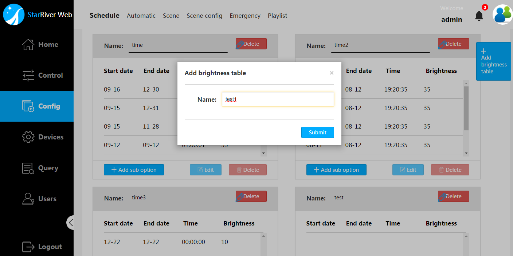
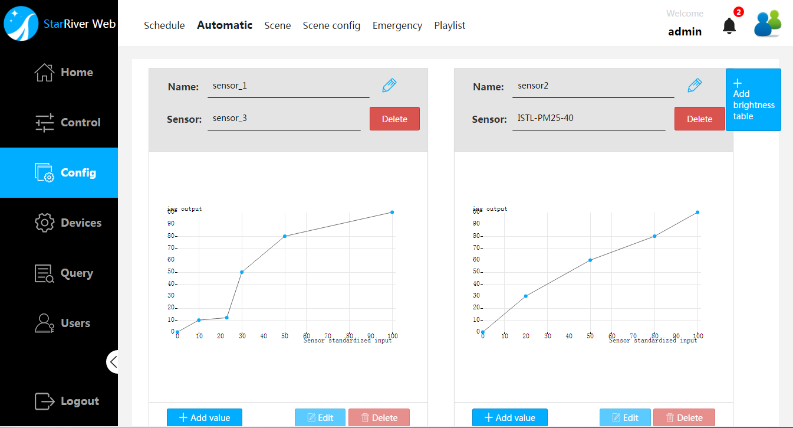
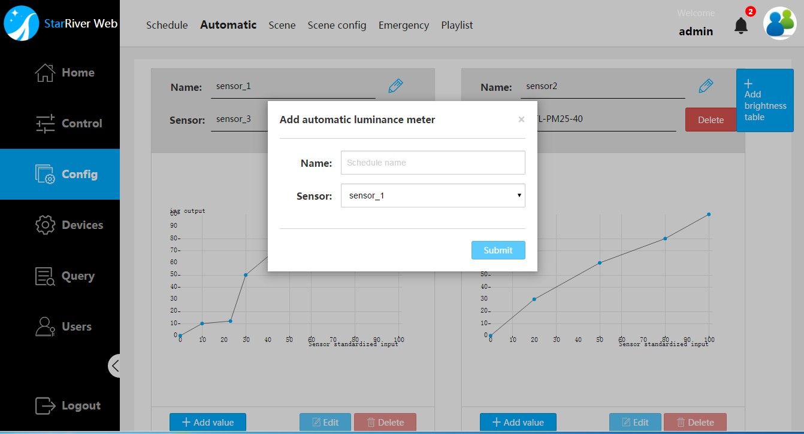
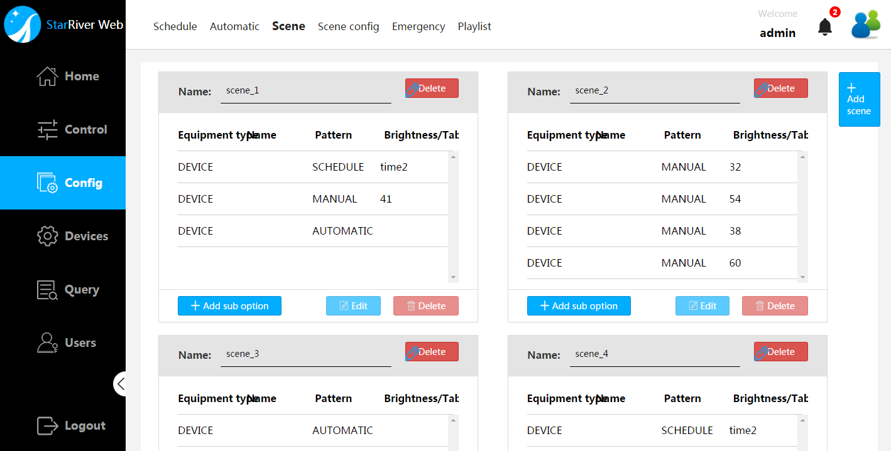
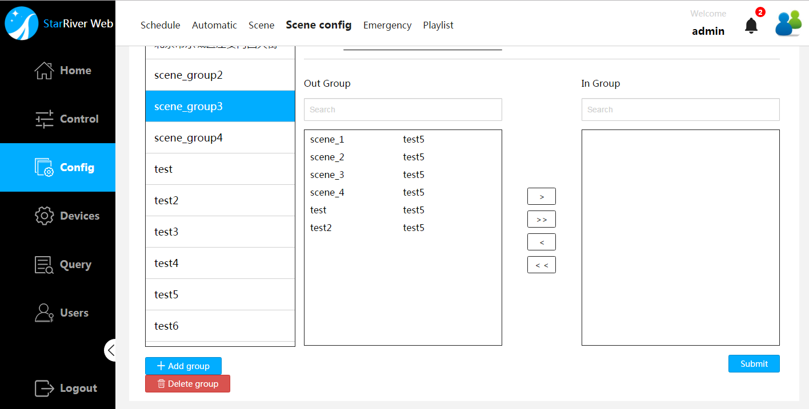
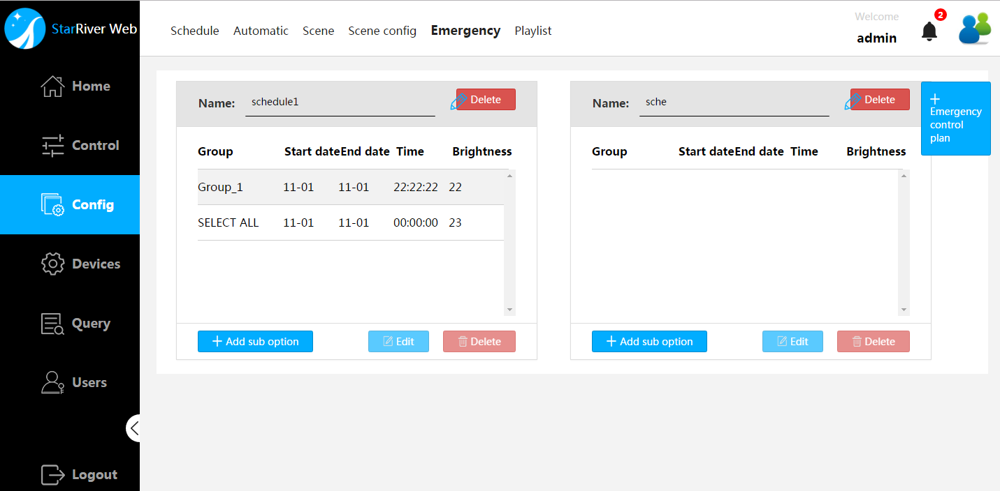

# Configuration

This chapter will give answers to the following questions:

- How to add a time-brightness schedule
- How to configure the light sensor
- How to add a scenario
- How to manage scenarios
- How to add a contingency plan
- How to add a playlist

## Time-Brightness Schedule

A time-brightness schedule is used as one of the three lamp-control patterns, each of which defines lamp brightness in multiple time periods accurate to second. It also can be applied in a scenario.

> **Note**: Time -brightness schedules are intended for the server systems with controllers that are always online.  Otherwise, define and use a contingency plan to make sure controllers offline (most of the time) and their lamps can function on schedule. 

### Add a Schedule

Instruction on how to add a time-brightness schedule is provided below.

1. Select `Config-Schedule` to enter the time-brightness schedules management screen.

   

   

   

2. Add a new time-brightness schedule by clicking on the  `+add brightness table` button. And then give a name for it in the popping-up dialog box. A blank schedule would be generated and shown up in the end of the schedule list.

   > **Tips**: Try scroll down to the end of the list if you can't locate the newly added schedule.

   

   

   

See the following sections to add sub options for the new schedule.

#### Add a Sub Option

1. Select `Config` - `Schedule` to enter the time-brightness schedules management screen.
2. Click on the `+ Add sub option` and fill in the table in the popping-up dialog box and click `Summit` to apply the changes.  Fields in the dialog box are elaborated in the table below.
3. Go through the same procedures in the steps above to add more sub options if necessary.

| Item       | Description                              |
| ---------- | ---------------------------------------- |
| Start Date | The beginning of the period in which devices shares the same brightness value |
| End Date   | The end of the period in which devices share the same brightness value |
| Time       | The exact time accurate to second in the `Start Date` to apply the designated brightness or the strategy |
| Brightness | Range from 0-100. 0 indicates a lamp that does not emit light while 100 indicates a lamp that grows as brightest as it can. |

#### Edit a Sub Option

1. Select `Config` - `Schedule` to enter the time-brightness schedules management screen.  
2. Locate the target sub option in the target schedule list and then click on the ` Edit` button which can be found in the lower right below sub option list of the schedule.  
3. After changing value in the popping-up dialog box click `Summit` to apply the change. The popping-up dialog box is the same as the one for adding a sub option, please refer to the table above for details.

#### Delete a Sub Option

1. Select `Config` - `Schedule` to enter the time-brightness schedules management screen.  
2. Locate the target sub option in the target schedule list and then click on the ` Delete` button which can be found in the lower right below sub option list of the schedule.  
3. To make sure it's not a mistaken operation, the system would have you click on the  `confirm` button in the popping-up confirmation box, as shown in the figure below.

### Edit the Name of a Schedule

1. Select `Config` - `Schedule` to enter the time-brightness schedules management screen.  
2. Locate the target schedule and then click on the  (pencil-shaped) button to enter a new name for the scenario.  And then don't forget to click the checkmark button to apply the change.

### Delete a Schedule

1. Select `Config` - `Schedule` to enter the time-brightness schedules management screen. 
2. Click on the ` Delete` button following the schedule name.  
3. To make sure it's not a mistaken operation, the system would have you click on the  `confirm` button in the popping-up confirmation box.

## Automatic-Dimming Configuration

A automatic-dimming strategy is used as one of the three lamp-control patterns, each of which defines the brightness dependence on light sensor inputs. It also can be applied in a scenario.

> Note: Automatic-dimming strategies are intended for the server systems with controllers that are always online.  Otherwise, define and use a contingency plan to make suer controllers offline (most of the time) and their lamps can function on schedule. 

A dependence chart features the followings:

1. Each dependence chart is dedicated for only one light sensor.
2. Each point of the curve on the chart indicates a target brightness value upon certain light sensor input. 
3. (0, 0) and (100, 100) are two fixed points of the dependence curve.
4. With more points added to the dependence curve, the more the target brightness will approach to ideal  effect.

### Add a Dependence

Instruction on how to add a dependence is provided below.

1. Add a light sensor.
   Select `Devices` - `Sensor` to enter the sensor management screen and add a light sensor.

2. Select `Config` - `Automatic` to enter the Automatic-brightness management screen.

3. Add a new brightness dependence by clicking on the  `+add brightness table` button. 

   

   

   

4. Give a name and specify one light sensor for it in the popping-up dialog box. 
   A blank chart would be generated and shown up in the end of the schedule list.

   > **Tips**: Try scroll down to the end of the list if you can't locate the newly added dependence chart.

   Draw the complete dependence line by adding values. See the following sections for instructions.

#### Add a Point

1. Select `Config` - `Automatic` to enter the Automatic dimming configuration screen.
2. Locate the target chart and click on the `+ Add value`. Give the light sensor input value and the target brightness value on it in the popping-up dialog box, and click `Summit` to apply the changes.  
3. Go through the same procedures in the steps above to add more points if necessary.

#### Edit a Point

1. Select `Config` - `Automatic` to enter the Automatic dimming configuration screen.
2. Locate the target chart and click on the `Edit`. Give the light sensor input value and/or the target brightness value on it in the popping-up dialog box.
3. After changing value in the popping-up dialog box click `Summit` to apply the change. 

#### Delete a Point

1. Select `Config` - `Automatic` to enter the Automatic dimming configuration screen.
2. Locate the target chart and click on the ` Delete` button which can be found in the lower right below the chart.  
3. To make sure it's not a mistaken operation, the system would have you click on the  `confirm` button in the popping-up confirmation box, as shown in the figure below.

### Edit the Name of a Dependence

1. Select `Config` - `Automatic` to enter the Automatic dimming configuration screen.
2. Locate the target chart and click on the  (pencil-shaped) button to enter a new name for the dependence.  And then don't forget to click the checkmark button to apply the change.

### Replace the sensor of a dependence

1. Select `Config` - `Automatic` to enter the Automatic dimming configuration screen.
2. Locate the target chart and click on the  (pencil-shaped) button. 
3. Select another light sensor from the sensor drop-down list.
4. Click the checkmark button to apply the change.

### Delete a Dependence

1. Select `Config` - `Schedule` to enter the time-brightness schedules management screen. 
2. Click on the ` Delete` button following the schedule name.  
3. To make sure it's not a mistaken operation, the system would have you click on the  `confirm` button in the popping-up confirmation box.

## Scenario

A scenario is a plan that defines the light-emitting patterns each device (could be lamp or controller) should follow. Applying a scenario implements a quick pattern switch for multiple devices at one time.

> **Note**: Scenarios are intended for the server systems with controllers that are always online.  Otherwise, define and use a contingency plan to make sure controllers offline (most of the time) and their lamps can function on schedule. 

### Add a Scenario

Select `Config` - `Scene` - `+ Add scene` , and click `Submit` after entering the scene name in the popping-up dialog box. A blank scenario will be generated and shown in the end of the scenario list.

Follow the instructions in the sections below to complete adding a useful scenario.

#### Add a Sub Option

1. Select `Config` - `Scene Config`, and click `+ Add sub option`  which can be found in the lower left below the target scenario.
2. Fill in the table in the popping-up dialog box and click `Summit` to apply the changes. Fields in the dialog box are elaborated in the table below.
3. Go through the same procedures in the steps above to add more sub options if necessary.

| Item           | Description                              | Note                                     |
| -------------- | ---------------------------------------- | ---------------------------------------- |
| Equipment Type | Choose `Device` or `Controller` in the drop-down list. | `Device` indicates lamps.                |
| Name           | Choose one of the devices in the drop-down list. | -                                        |
| Pattern        | Choose one of the control pattern in the drop-down list, i.e. `Manual`, `Automatic` and `Schedule`. | When `Automatic` or `Schedule`  has been chosen, you need to specify a sensor or schedule in the drop-down list. |
| Brightness     | Range from 0-100. 0 indicates a lamp that does not emit light while 100 indicates a lamp that grows as brightest as it can. | Only would be shown up when the `Manual` pattern chosen. |

#### Edit a Sub Option

1. Select `Config` - `Scene`.  
2. Locate the target sub option in the target scenario list and click on the ` Edit` button which can be found in the lower right below sub option list of the scenario.  
3. After changing value in the popping-up dialog box click `Summit` to apply the change. The popping-up dialog box is the same as the one for adding a sub option, please refer to the table above for details.

#### Delete a Sub Option

1. Select `Config` - `Scene`.  Locate the target sub option in the scenario list and then click on the ` Delete` button which can be found in the lower right below sub option list of the scenario.  
2. To make sure it's not a mistaken operation, the system would have you click on the  `confirm` button in the popping-up confirmation box, as shown in the figure below.

### Edit the Name of a Scenario

Select `Config` - `Scene Config`, and select the target scenario in the list. Click the  (pencil-shaped) button to enter a new name for the scenario.  And then don't forget to click the checkmark button to apply the change.

### Add/Remove Scenarios to/from a Group

The  `in group` list of a newly added scenario group would be blank.

1. Select `Config` - `Scene Config`, and choose the target group.
2. Choose a scenario from the `out group` list and add it to the group by clicking  `>`. 
   Or, select the target scenario in the `in group` list and remove it from the group by clicking `<`.

> **Tips:**
>
> 1. Enter the name or any word contained in the name of the scenario into the filter to search rapidly in the `Out group` or `in group` search box.
> 2. Use`>>` or to add all lamps in the list into the group or `<<` to remove all lamps in the list from the group.

3. Click `Summit` to apply the change.

### Delete a Scenario 

1. Select `Config` - `Scene`.  Locate the target scenario and then click on the ` Delete` icon which can be found in the upper right following the scenario name.  
2. To make sure it's not a mistaken operation, the system would have you click on the  `confirm` button in the popping-up confirmation box, as shown in the figure below.

## Group Scenarios

Scenarios are displayed by groups in the `Control` - `Shortcut` screen where a scenario can be applied simply by clicking one button, which means that, a scenario can only be found and applied when it is one of the scenario group member.

To group scenarios, select  `Config` - `Scene Config`, as the figure shown below. 

### Add a Scenario Group

Select `Config` - `Scene Config` - `+ Add group` , and click `Submit` after entering the group name in the popping-up dialog box.

### Edit the Name of a Scenario Group

Select `Config` - `Scene Config`, and select the target group in the list. Click the  (pencil-shaped) button, to enter a new name for the group.  And then don't forget to click checkmark button to apply the change.

### Add/Remove Scenarios to/from a Group

The  `in group` list of a newly added scenario group would be blank.

1. Select `Config` - `Scene Config`, and choose the target group.
2. Choose a scenario from the `out group` list and add it to the group by clicking  `>`. 
   Or, select the target scenario in the `in group` list and remove it from the group by clicking `<`.

> **Tips:**
>
> 1. Enter the name or any word contained in the name of the scenario into the filter to search rapidly in the `Out group` or `in group` search box.
> 2. Use`>>` or to add all lamps in the list into the group or `<<` to remove all lamps in the list from the group.

3. Click `Summit` to apply the change.

### Delete a Scenario Group

1. Select `Config` - `Scene Config`.  Locate the target group and then click on the ` Delete Group` icon which can be found in the lower right corner below the list.  
2. To make sure it's not a mistaken operation, the system would have you click on the  `confirm` button in the popping-up confirmation box, as shown in the figure below.

## Emergency control

Define and use a contingency plan to make sure controllers offline (most of the time) and their lamps can function on schedule.  A contingency plan would be also fit for the occasionaly down time period of online controller. The instruction on how to choose the plan for an emergency, see `Control` - `System Control`.

Before creating a contingency plan, make sure the lamps are in groups. Lamps of the same controllers are recommended to be grouped into a same group. For instructions on how to group lamps, see Section [`Device` - `Group`](../part1/device).

This section provides information on how to create and edit a contingency plan. 

### Add a Contingency Plan

Instruction on how to add a contingency plan is provided below.

1. Select `Config` - `Emergency` to enter the contingency plans management screen.

2. Add a new contingency plan by clicking on the  `+ Emergency control plan` button. And then give a name for it in the popping-up dialog box. A blank schedule would be generated and shown up in the end of the schedule list.

   > **Tips**: Try scroll down to the end of the list if you can't locate the newly added schedule.

   See the following sections to add sub options for the new schedule.

#### Add a Sub Option

1. Select `Config` - `Emergency` to enter the contingency plans management screen.
2. Click on the `+ Add sub option` and fill in the table in the popping-up dialog box and click `Summit` to apply the changes.  Fields in the dialog box are elaborated in the table below.
3. Go through the same procedures in the steps above to add more sub options if necessary.

| Item       | Description                              |
| ---------- | ---------------------------------------- |
| Start Date | The beginning of the period in which devices shares the same brightness value |
| End Date   | The end of the period in which devices share the same brightness value |
| Time       | The exact time accurate to second in the `Start Date`/`End Date` to start/end the period |
| Brightness | Range from 0-100. 0 indicates a lamp that does not emit light while 100 indicates a lamp that grows as brightest as it can. |
| Group      | Choose a lamp group from the drop-down list, all member in which will act upon the plan above. |

#### Edit a Sub Option

1. Select `Config` - `Emergency` to enter the contingency plans management screen.  
2. Locate the target sub option in the target schedule list and then click on the ` Edit` button which can be found in the lower right below sub option list of the schedule.  
3. After changing value in the popping-up dialog box click `Summit` to apply the change. The popping-up dialog box is the same as the one for adding a sub option, please refer to the table above for details.

#### Delete a Sub Option

1. Select `Config` - `Emergency` to enter the contingency plans management screen.  
2. Locate the target sub option in the target schedule list and then click on the ` Delete` button which can be found in the lower right below sub option list of the schedule.  
3. To make sure it's not a mistaken operation, the system would have you click on the  `confirm` button in the popping-up confirmation box, as shown in the figure below.

### Edit the Name of a Schedule

1. Select `Config` - `Emergency` to enter the contingency plans management screen. 
2. Locate the target schedule and then click on the  (pencil-shaped) button to enter a new name for the scenario.  And then don't forget to click the checkmark button to apply the change.

### Delete a Schedule

1. Select `Config` - `Emergency` to enter the contingency plans management screen.
2. Click on the ` Delete` button following the schedule name.  
3. To make sure it's not a mistaken operation, the system would have you click on the  `confirm` button in the popping-up confirmation box.