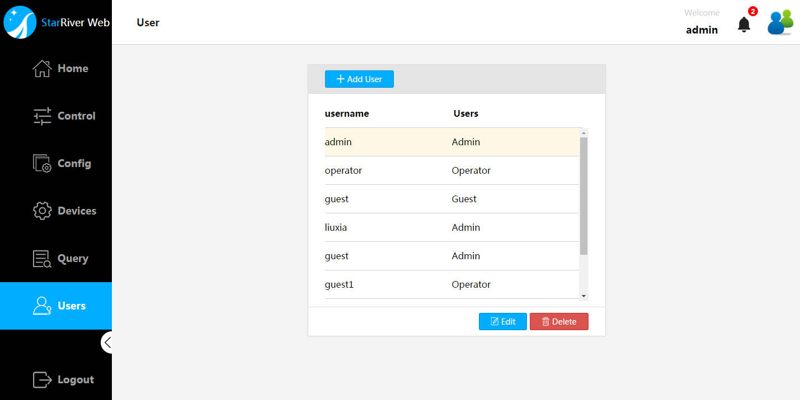
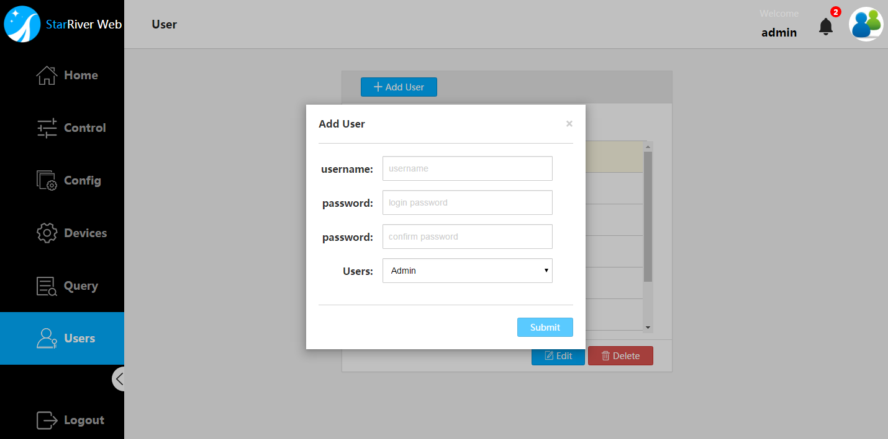
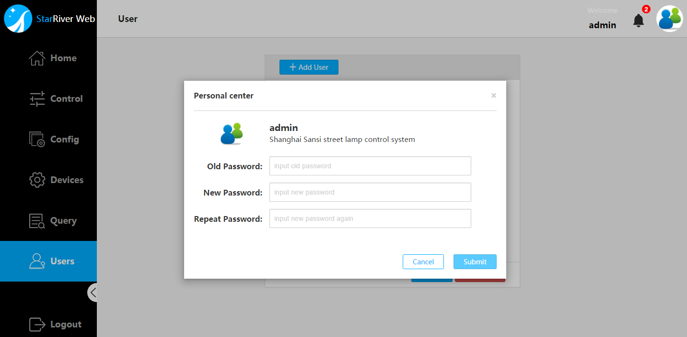

# User and Account Settings

This chapter provides information on user and account settings.

## User Management

Select `Users`, as shown in the following figure. 

> **Note**: Only administrator users (admin) are allowed to take actions on this page.

### Add a User

To add a user:

1. Click `User` to enter the account setting page.
2. Click `+ Add User`.
3. Give the user name and the password. The password need to be given twice to prevend any typo. And then choose a user type so that privilege is provided to limited number of users who actually need it.
4. Click `Submit` to save the change.

  
  

   

The following table specifies the three user types.

| User type | description                              |
| --------- | ---------------------------------------- |
| `admin`   | A user with all privileges, is recommended to assign it to a administrator of the system |
| `user`    | A user with configuration right but is not allowed to make any account settings, is recommended to assign it to a operator of the system. |
| `guset`   | A user can browse without making any change to the system, is recommended to assign it to a data/information agent. |

### Change User Type

1. Click `User` to enter the account setting page.
2. Select the target user in the list, and then click `Edit`. The table above specifies the three user types.
3. Choose another user type for the user.
4. Click `Submit` to save the change.

### Delete user 

1. Click `User` to enter the account setting page.
2. Select the target user in the list, and then click `Delete` to remove it.
3. To make sure it's not a mistaken operation, the system would have you click on the  `confirm` button in the popping-up confirmation box.

## Change Password

To change the password of your current account:

1. Click on the user icon on the upper right of the screen.
2. Give the current password to get authorized and enter the new password twice to change and confirm the change as the illustration shown below.
3. Click `Submit` to apply the change.

