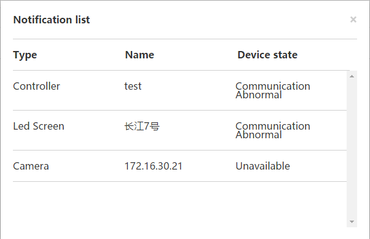

# Notification

Any failure of the system would be collected and pushed to the notification list which can be seen by clicking  on the upper right of the screen. The superscript number indicates the total amount of failure record messages.

