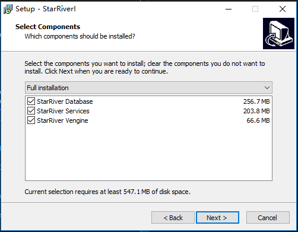
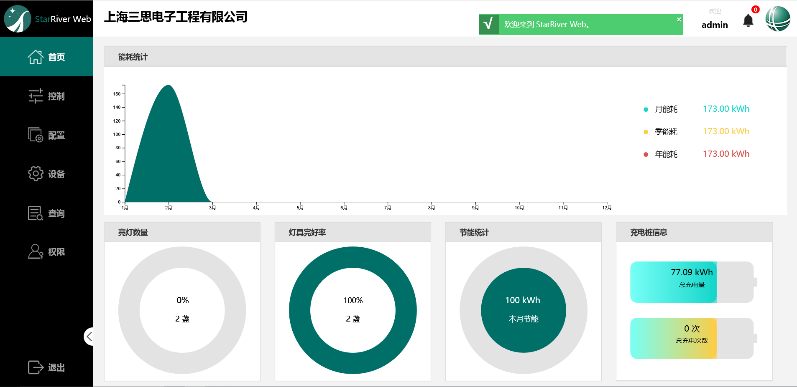

# 安装

StarRiver Server 有两个模块：数据库系统和 StarRiver 通信应用程序。

## 环境要求

StarRiver Web 服务器以及数据库服务端的安装和运行需要如下环境。

### 硬件

#### 最低配置

- 四核 CPU，英特尔* 酷睿* i5 及以上
- 8GB 内存
- 100M 网络连接

#### 建议配置

- 六核 CPU，英特尔* 至强* E5 及以上
- 32GB ECC 内存
- 千兆网络

> 说明：建议有线连接网络，使用 Wi-Fi 连接可能因网络原因导致控制响应延迟增加。

### 软件

#### 最低配置

- Windows Server 2008
- MySQL Server 5.5 (MariaDB 5.5)

#### 建议配置

- Windows Server 2008 以上版本或 Windows 7 以上版本
- MySQL Server 5.6+ (MariaDB 10.0+)

#### 兼容的浏览器

- Chrome
- Firefox
- Safari
- Internet Explorer 10+
- Edge

## 安装 StarRiver 系统

运行 `StarRiver_setup.exe`，选择你想安装的组件后使用默认设置完成安装。



## 配置

系统首次运行前请做如下配置：

$(install_path)\starriver-service\global.json

1. 编辑上述文件中的 `CORS` 小节。 将您的 IP 地址添加到 `Origins` 列表。 以*172.16.40.70*为例，如下:

```@json
"CORS": {
    "Credentials": false,
    "Origins": ["http://localhost", "http://127.0.0.1", "http://172.16.40.70"],
    "Headers": ["authorization"],
}
```
2. 重启。

现在你可以通过 *http://172.16.40.70* 访问 StarRiver 

## 登录

1. 在浏览器中输入StarRiver Web页面的IP地址，转到登录页面。

2. 在登录框中输入用户名和密码登录。管理员用户名为`admin`，初始密码为`admin`。
   ​
   登录后，能看到主页是一个信息板，上面有能耗统计、亮灯数量、灯具完好率、节能统计等数据图表。 

   