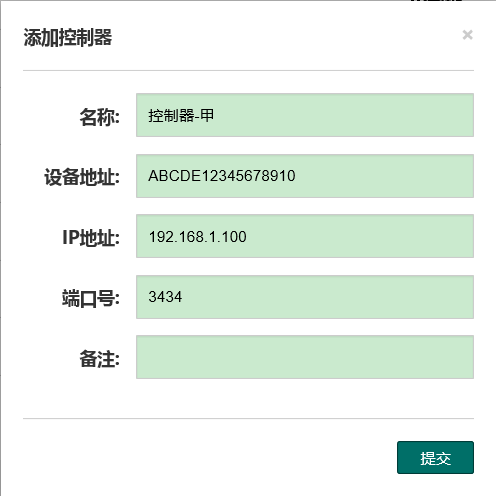
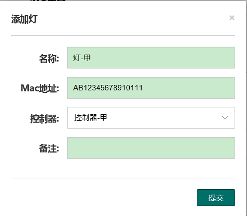

# 向导

初次使用照明管理系统，可参考本章节的案例进行配置和使用。本章案例仅列出了典型的使用场景，未详尽之处，请查看本文档相应章节。

张三是照明系统的管理人员，他需要对分别连在2台控制器上的4盏路灯进行设置，使他们按照以下计划照明。

| 灯    | 控制器  | 第一季度 白天            | 第一季度 夜晚            | 第二季度 白天            | 第二季度 夜晚            |
| ---- | ---- | ------------------ | ------------------ | ------------------ | ------------------ |
|      |      | 6 :00:00 -18:00:00 | 18 :00:00 -6:00:00 | 5 :00:00 -19:00:00 | 19 :00:00 -5:00:00 |
| 甲    | 甲    | 灭                  | 亮                  | 灭                  | 亮                  |
| 乙    | 甲    | 灭                  | 亮                  | 灭                  | 亮                  |
| 丙    | 乙    | 灭                  | 亮                  | 灭                  | 亮                  |
| 丁    | 乙    | 灭                  | 50% 亮              | 灭                  | 50% 亮              |

> **说明**：
>
> - 进入第二季度以后，白天时间变长，所以适当减少亮灯时间。
> - 丁在居民楼附近，为减少灯光污染，开启时始终为50%亮度。

## 添加设备

首先，我们要将4盏灯以及他们的控制器都添加到系统中进行管理和控制。

### 添加控制器

控制器与系统直接通信，因此添加灯前，必须添加控制器。

1. 点击`设备` - `控制器`进入控制器管理页面。

2. 点击`+ 添加控制器`, 弹出`添加控制器`对话框。

3. 输入设备信息举例如下图，完成后，点击`提交`。提交后可以看到新添加的控制器出现在列表中。

   

   - 设备地址，指控制器的物理地址，可以在控制器的出厂说明中找到
   - IP地址，是控制器的网络地址，请确保该地址与服务器所在网络互通
   - 端口号，默认*3434*，如果该端口号被占用，请进行测试找出可用端口再填写，如*3435*。
4. 重复步骤*2*和*3*，添加*控制器乙*。
5. 在列表中检查一下新添加的信息是否有误，如果需要修改，点击更正信息。检查无误后，进入下一个步骤。

### 添加灯

控制器添加完成后，开始添加灯。

1. 点击`设备` - `灯`进入灯的管理页面。

2. 点击`+ 添加灯`, 弹出`添加灯`对话框。

3. 输入设备信息举例如下图，完成后，点击提交。提交后可以看到新添加的灯出现在列表中。

   

   - Mac地址，指灯的物理地址，可以在灯的出厂说明中找到
   - 控制器，根据例子中给出的信息，我们知道*甲灯*是连接在*控制器甲*上的，因此这里选择*控制器甲*。实际操作中，请根据设备物理连接进行选择。
4. 重复步骤*2*和*3*，直至*乙灯*、*丙灯*和*丁灯*都添加完成。
5. 在列表中检查一下新添加的信息是否有误，如果需要修改，点击更正信息。
   检查无误后，进入下一个步骤。

### 编辑分组

将照明计划相同的灯加入一个分组便于后续进行控制，尤其是需要创建和使用紧急控制计划时，都需要对以组为对象的设备进行操作。
> **说明**：紧急控制计划是作为控制器突然掉线时的应急计划，后续步骤会有详细介绍。

本例中，根据给出的照明计划，由于只有丁灯的照明亮度与其他灯不同，因此我们将*甲*、*乙*、*丙*分到*分组1*，将丁，分到*分组2*。
1. 点击`设备` - `分组`，点击`添加组`创建*分组1*。
2. 将*甲*、*乙*、*丙*灯添加到新建好的分组中，点击`提交`。
3. 添加*分组2*。
4. 把丁灯添加到*分组2*，点击`提交`。
>**说明**：添加好后，由于网络时延，可能无法立即看到该做出的改动，此时无需重复操作，稍后进行页面刷新即可看到更改的信息。
### 推送更新
上述设备添加和分组完成后，需要告知系统和控制器，设备信息已经更新，因此需要务必进行以下操作：
1. 重启服务：点击`设备` - `重启服务` -`重启`。
2. 等待重启完成后重新登陆。
3. 发布设置：
   点击`设备` - `发布设置`，点击*控制器甲*和*控制器乙*后对应的`发布`按钮。

至此，本例中的设备添加步骤已经全部结束，可以开始进行照明计划配置。

## 照明计划配置

根据给出的照明计划要求，我们需要创建时间亮度表和场景，同时，还需要创建紧急控制表，保证在通讯故障时，照明计划能不受影响。

紧急控制计划除了作为控制器突然掉线时的应急计划，还适用于控制器不长时在线的照明系统。在这种系统中，控制器只在配置时上线，将紧急计划推送到控制器，此后，控制器处在`Auto`模式，紧急计划将作为它的日常计划。因此，选用这种模式的系统可跳过时间亮度表和场景创建，直接跳至`创建紧急计划表`章节。

### 创建时间亮度表
打开`配置` - `时间亮度表`创建如下2张时间亮度表：

1. 创建*亮度表1*，亮灯时亮度为*100*。
   | 开始时间  | 结束时间  | 时间       | 亮度   |
   | ----- | ----- | -------- | ---- |
   | 01-01 | 03-31 | 06:00:00 | 0    |
   | 01-01 | 03-31 | 18:00:00 | 100  |
   | 04-01 | 06-30 | 05:00:00 | 0    |
   | 04-01 | 06-30 | 19:00:00 | 100  |

2. 创建第二张*亮度表2*，亮灯时亮度为*50*，与上表唯一的不同就是亮度*100*替换成*50*，因为按照计划，丁灯的亮度是*50*，此表将用于*丁灯*的调光策略。
   | 开始时间  | 结束时间  | 时间       | 亮度   |
   | ----- | ----- | -------- | ---- |
   | 01-01 | 03-31 | 06:00:00 | 0    |
   | 01-01 | 03-31 | 18:00:00 | 50   |
   | 04-01 | 06-30 | 05:00:00 | 0    |
   | 04-01 | 06-30 | 19:00:00 | 50   |

> **说明**：添加好后，由于网络时延，可能无法立即看到该做出的改动，此时无需重复操作，稍后进行页面刷新即可看到更改的信息。

### 创建场景

1. 创建好时间亮度表后，切换到`场景`开始创建如下场景。
   | 设备类型       | 名称    | 模式    | 亮度/表名  | 说明                           |
   | ---------- | ----- | ----- | ------ | ---------------------------- |
   | Controller | 控制器-甲 | 时间亮度表 | *亮度表1* | 设备类型选择控制器，将时间亮度表应用于该控制器下的所有灯 |
   | Device     | 灯-丙   | 时间亮度表 | *亮度表1* | 同一控制器下的*丙*、*丁*灯需要应用不同的亮度表    |
   | Device     | 灯-丁   | 时间亮度表 | *亮度表2* | 按照需求，为*丁灯*选择了亮度为*50*的*亮度表2*  |

​                场景将上一步骤制定的时间与亮度的计划应用在了相应的设备上。

2. 为了便于快速应用场景，我们还要将场景加到分组中去。
   打开`配置` - `场景配置`，添加组并把*场景*添加到组内，点击`提交`即可。

### 创建紧急计划表

紧急控制计划除了作为控制器突然掉线时的应急计划，还适用于控制器不长时在线的照明系统。在这种系统中，控制器只在配置时上线，将紧急计划推送到控制器，此后，控制器处在`Auto`模式，紧急计划将作为它的日常计划。

打开`配置` - `紧急控制`，配置如下紧急控制表满足照明计划。

| 分组   | 开始日期  | 结束日期  | 时间       | 亮度   |
| ---- | ----- | ----- | -------- | ---- |
| 选择所有 | 01-01 | 03-31 | 6:00:00  | 0    |
| 分组1  | 01-01 | 03-31 | 18:00:00 | 100  |
| 分组2  | 01-01 | 03-31 | 18:00:00 | 50   |
| 选择所有 | 04-01 | 06-30 | 5:00:00  | 0    |
| 分组1  | 04-01 | 06-30 | 19:00:00 | 100  |
| 分组2  | 04-01 | 06-30 | 19:00:00 | 50   |

> **说明**：在编组步骤中，我们已经将甲、乙、丙三个灯分到分组1，丁灯分到分组2。

## 执行配置计划
以上步骤结束后，可以开始控制设备，让他们执行我们已经配置好的计划。

1. 打开`控制` - `系统控制`，在控制器列表中，为每个控制器选择上一步骤创建好的紧急控制表，并点击`应用`。
2. 查看控制器的工作模式是否为`Remote`,如果不是请切换到`Remote`。
>**说明**：在`Remote`模式下，才能应用场景（下一个步骤），而在`Auto`模式下，则会执行上一步骤推送过去的紧急控制计划。
3. 设置设备故障时，如通信故障时的策略：选择*紧急时控计划*，在触发时间中输入*30（分钟）*点击`应用`。
4. 打开`控制` - `快捷操控`，选择*场景*，点击`应用`。

介绍紧急控制计划时已经提到，在控制器长时离线的系统中，可以使用紧急控制计划执行照明计划，步骤如下：
1. 打开`控制` - `系统控制`，在控制器列表中，为每个控制器选择上一步骤创建好的紧急控制表，并点击`应用`。
2. 确认控制器的工作模式是否为`Auto`,如果不是请切换到`Auto`。
