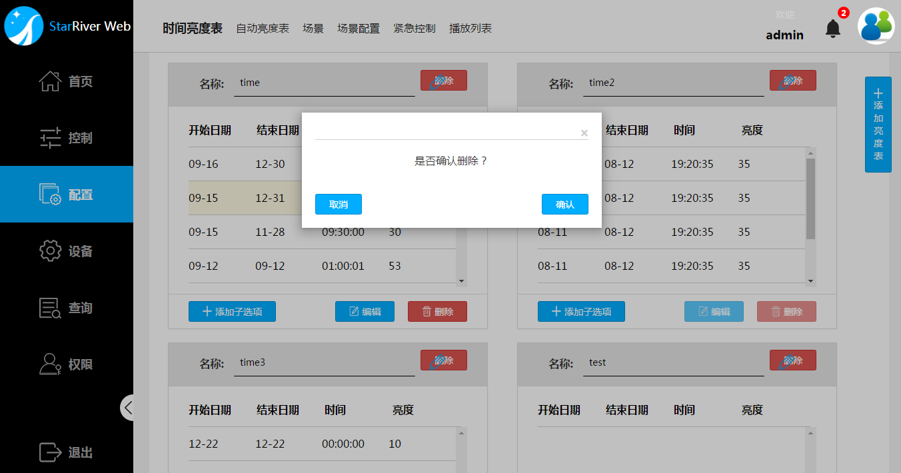
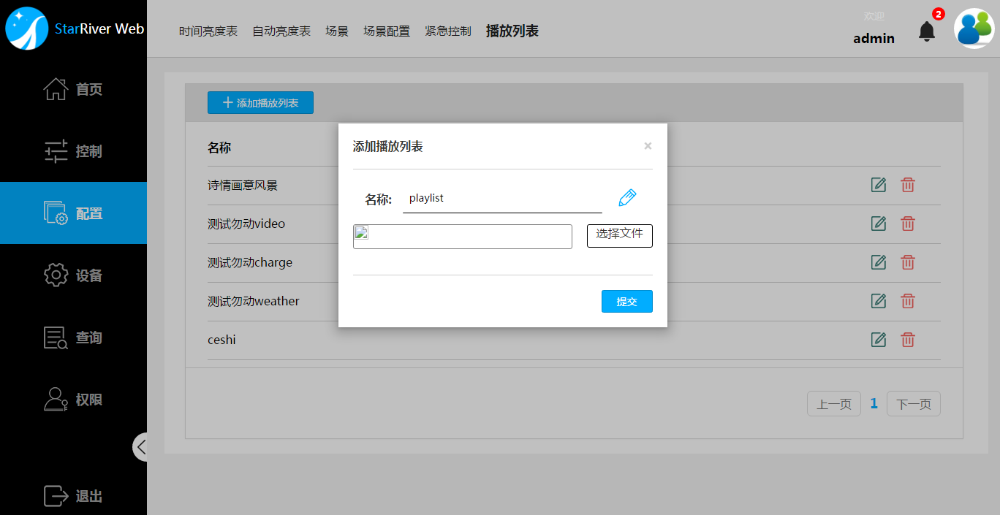

# 配置

通过在照明管理系统创建和应用不同的场景，可实现复杂的周期照明计划。

设置满足照明计划要求的紧急控制计划，作为场景的备份，将可能出现的通讯网络故障对照明计划带来的影响降低到最小。

本章将介绍创建场景、紧急计划的步骤。在这之前，还将介绍两种亮度表，可选择其中一种应用在场景中。

最后，还将介绍如何添加智慧路灯广告屏的播放列表。

## 配置时间亮度表

照明管理系统可通过两种方式实现自动亮度控制，本节将介绍第一种方式，时间亮度表。

时间亮度表定义了一个或多个时间段中，灯的亮度值。
在实际应用中，预先定义好合理的时间亮度表，能大大节省控制设备花费时间。

> **说明**：时间亮度表适合控制器与服务器之间网络一直联通的情况下使用，如果控制器多数时间为离线状态，建议使用紧急控制安排设备亮度。

### 添加时间亮度表

1. 点击 `配置` - `时间亮度表` - `+ 添加亮度表` 。
2. 在弹出的对话框中并输入亮度表的名称，如下图所示。
3. 点击 `提交` 按钮。
   

添加完成后，可在列表末端找到刚刚添加的时间亮度表。参考下面章节，为该表添加子选项。

### 编辑时间亮度表

#### 添加子选项

1. 点击 `配置` - `时间亮度表`。

2. 找到相应的亮度表，点击`+添加子选项` 并输入相应的`开始日期`，`结束日期`，`时间`和`亮度`，点击 `提交` 按钮即可，如下图所示。

   | 参数   | 说明                                       |
   | ---- | ---------------------------------------- |
   | 开始日期 | 同一亮度开始日期                                 |
   | 结束日期 | 同一亮度结束日期                                 |
   | 时间   | 亮度开始执行时间，表示在这个开始日期的这一时间点切换成目标亮度，后续如无新的子项目规定不同亮度，设备将保持亮度不变。 |
   | 亮度   | 指定0-100的亮度值，0表示不亮，100表示全亮。               |

> **说明**：`时间`表示在`开始日期`中的开始时刻。如下图所示数据表明，在2月16号0点开始，亮度为65。
>
> - 如果在结束时间后，没有定义新的亮度值，则设备保持现有亮度。例如，在下图的这个例子中，2月16号12点过后，如果没有定义新的亮度值，设备将保持65这一亮度，直到下一个不同亮度的时间段到来。
> - 如果在结束时间前，又定义了新的亮度值，则设备按照时间段较晚的亮度进行显示。例如，[向导]()章节的例子中，规定了6点灭灯，但还规定18点亮灯，组合起来执行的结果是6-18点期间灭灯，18点-6点期间亮灯。

3. 重复步骤2，按照实际照明计划要求完成子选项添加。

#### 编辑子选项

1. 点击 `配置` - `时间亮度表`。
2. 找到相应的亮度表，选中需要编辑的子选项，点击对应亮度表下方的 `编辑` 按钮，然后根据需求修改子选项里面的内容。
3. 点击 `提交` 按钮。  

#### 删除子选项

1. 点击 `配置` - `时间亮度表`。
2. 找到相应的亮度表，选中需要删除的子选项，点击对应亮度表下方的 `删除` 按钮，
3. 在弹出的确认对话框中点击`确认`。

### 修改亮度表名称

1. 点击 `配置` - `时间亮度表`。
2. 找到相应的亮度表，点击按钮，修改表名称。
3. 点击保存修改。  

### 删除时间亮度表

1. 点击 `配置` - `时间亮度表`。
2. 找到相应的亮度表，点击相应的 `删除` 按钮，
3. 在弹出的确认对话框中点击`确认`。  

## 配置自动亮度表

照明管理系统可通过两种方式实现自动亮度控制，本节将介绍第二种方式，自动亮度表。

每个自动亮度表定义一个亮度传感器对应灯亮度的关系。因此，定义自动亮度表前，请确认已经添加至少一个亮度传感器。

> **说明**：自动亮度表适合控制器与服务器之间网络一直联通的情况下使用，如果控制器多数时间为离线状态，建议使用紧急控制安排设备亮度。

亮度表曲线的x轴代表标准化传感器输入，y轴代表亮度输出。应用自动亮度表后，当系统检测到曲线上的节点，则按照亮度表给出的数值进行调光。新建的自动亮度表默认有两个点(0, 0)和(100,100)，且不可修改和删除。新建的自动亮度表一条单调增加直线，亮度值将随着传感器标准化输入值的增加而增加，减小而减小。

### 添加自动亮度表

1. 点击 `配置` - `自动亮度表` - `+添加亮度表` ，输入亮度表的名称。
2. 在传感器的下拉菜单中选择一个传感器。
3. 点击 `提交` 。  

根据实际情况，如果需要对曲线进行调整，例如增加调光节点，请参考以下内容进行编辑。

### 编辑自动亮度表

#### 添加数值

1. 点击 `配置` - `自动亮度表`。
2. 找到目标自动亮度表，点击`+添加数值` 。
3. 在弹出的对话框输入相应的传感器标准化输入数值和调光输出数值。
   *例如，需要增加调光节点，可输入50，50。该点是原曲线上的点，但是增加节点后，系统检测到相应输入后将进行调光操作。*
4. 点击 `提交` 按钮。  

#### 编辑数值

1. 点击 `配置` - `自动亮度表`。
2. 找到目标自动亮度表，点击需要编辑的节点，点击`编辑` 。
3. 在弹出的对话框输入相应的传感器标准化输入数值和调光输出数值。
   *例如，在感应到相同外界亮度时，需要增加原有亮度。选择(50, 50)，输入50，60。*
4. 点击 `提交` 按钮。  

#### 修改亮度表名称与传感器

1. 点击 `配置` - `自动亮度表`。
2. 找到目标自动亮度表，点击。
3. 修改步骤如下，完成后，点击。
   * 名称栏中输入新的亮度表名称
   * 在传感器下拉菜单中选择需要替换的传感器，如下图所示。  

### 删除自动亮度表

1. 点击 `配置` - `自动亮度表`。
2. 找到目标自动亮度表，点击`删除`。
3. 在弹出的确认对话框中点击`确认`。

## 配置场景

每个场景中可定义多个设备（灯或控制器）的亮度值由何种方式决定。共有三种方式：

- 手动指定这段时间的亮度值。
- ​指定一张时间亮度表
- 指定一张自动亮度表

> **说明**：在场景中添加和定义控制器的亮度值等同于定义了连接在控制器中灯的亮度值。当然，这些灯必须是已经添加到系统中进行管理的。

场景适合控制器与服务器之间网络一直联通的情况下使用，如果控制器多数时间为离线状态，建议使用紧急控制安排设备亮度。

### 添加场景

1. 点击 `配置` - `场景` - `+ 添加场景` 。
2. 在弹出的对话框中并输入亮度表的名称。
3. 点击 `提交` 按钮。

添加完成后，可在列表末端找到刚刚添加的场景。参考下面章节，为该场景添加子选项。

### 编辑场景

#### 添加子选项

1. 点击 `配置` - `场景`。

2. 找到相应的亮度表，点击`+添加子选项` 。

3. 选择设置参数：

   | 参数    | 说明                                       |
   | ----- | ---------------------------------------- |
   | 设备    | 选择设备类型，灯或控制器。选择控制器相当于选择了所有连接在该控制器上的灯。当然，这些灯必须是已经添加到系统中进行管理的。 |
   | 名称    | 在下拉表单中选择设备名称。                            |
   | 模式    | 选择一种亮度模式，手动、时间亮度表或自动亮度表                  |
   | 亮度/表名 | 选择手动模式后，指定0-100的亮度值，0表示不亮，100表示全亮。选择亮度表的，在下拉表单中选择相应的亮度表。 |

4. 点击`提交`按钮。

5. 重复步骤2-4，添加不同亮度模式的设备和不同控制器下的设备，直至按照照明计划完成部署。

#### 编辑子选项

1. 点击 `配置` - `时间亮度表`。
2. 找到相应的亮度表，选中需要编辑的子选项，点击对应亮度表下方的 `编辑` 按钮，然后根据需求修改子选项里面的内容。
3. 点击 `提交` 按钮。  

#### 删除子选项

1. 点击 `配置` - `时间亮度表`。
2. 找到相应的亮度表，选中需要删除的子选项，点击对应亮度表下方的 `删除` 按钮，
3. 在弹出的确认对话框中点击`确认`。

### 修改场景名称

1. 点击 `配置` - `场景`。
2. 找到相应的场景，点击按钮，修改名称。
3. 点击保存修改。  

### 删除场景

1. 点击 `配置` - `场景`。
2. 找到相应的场景，点击相应的 `删除` 按钮，
3. 在弹出的确认对话框中点击`确认`。

## 场景分组

添加场景后，可在`控制` - `快捷操控`中看到分组显示的场景，并进行选取和应用。

> **说明**：当选中一个场景时，
>
> * `非组内场景模式` 列表中列出了所有不在本组的场景。
> * `组内场景模式` 列表中列出了所有在该组的场景。

### 添加场景分组

1. 点击 `配置` - `场景配置` - `+添加组` 。
2. 在弹出的对话框，输入名称，如下图所示。
3. 点击 `提交`。 

### 编辑场景组名称

1. 点击 `配置` - `场景配置` 。
2. 点击选择需要编辑的场景，点击按钮，在名称栏中输入新的分组名称。
3. 点击保存修改，如下图所示。  

### 编辑场景分组成员

1. 点击 `配置` - `场景配置` 。
2. 点击选择需要编辑的场景。
3. 在非组内场景模式列表中选择场景模式，点击`>`添加到组内，或点击`>>`将列表中的全部场景添加到组内；
   选择组内场景模式列表中的场景模式，点击`<`将对象移出分组，或点击`<<`将列表中的全部场景移出分组。
   如下图所示。

### 删除场景分组

1. 点击 `配置` - `场景配置` 。
2. 点击选择需要删除的场景。
3. 点击`删除`按钮。
4. 在弹出的对话框中确认删除。

## 配置紧急控制计划表

紧急控制计划表适用于控制器与服务器网络无法一直联通的场景，将控制器设置为自动（`Auto`）模式后，执行紧急控制计划。同时，在网络通畅的场景中，也可作为网络中断等突发情况的备用方案。

配置紧急控制计划表指定了每个分组设备在分段时间中的亮度。

> **说明**：
>
> - 紧急控制计划表需要添加以组为单位的设备，请现在`设备` - `分组`中把设备进行分组。
> - 同时间亮度表类似，紧急控制计划中的`时间`表示指定亮度开始执行的时间，精确到秒。

## 配置播放列表

播放列表定义了智慧路灯上的广告板播放内容。在系统中添加智慧路灯及其广告屏，并上传播放列表，之后可以在`地图视图`中，将播放列表上传到设备进行显示。

### 添加播放列表

1. 点击 `配置` - `播放列表` - `+添加播放列表` 。
2. 在弹出的对话框中，点击`选择文件`，上传播放列表。上传完成后，对话框将出现列表的预览画面。
3. 系统将自动读取播放列表的文件名作为该播放列表名称，如需修改，点击，修改后按下即可。
4. 点击 `提交` 即可，如下图所示。
   

### 编辑播放列表

1. 点击 `配置` - `播放列表` 。
2. 找到需要编辑的列表，点击后方的编辑按钮。
3. 在弹出的对话框中：
   * 点击`选择文件`，替换原播放列表。系统将自动读取播放列表的文件名作为该播放列表名称。
   * 点击，修改列表名称，按下。
4. 点击 `提交`。
   

###   删除播放列表

1. 点击 `配置` - `播放列表`。
2. 找到需要删除的列表，点击其后方的删除按钮。
3. 在弹出的确认对话框中点击 `确认` 按钮，如下图所示。  
