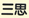
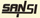

# 声明

上海三思注明之服务条款外，其他任何包含于、经由、或联结、下载或从任何与我公司有关服务(以下简称服务)所获得之资讯、内容或广告（以下简称资料）而引致之任何意外、疏忽、合约毁坏、诽谤、版权或知识产权侵犯及其所造成的损失（包括因下载而感染电脑病毒），上海三思概不负责，亦不承担任何法律责任。并且，对于您透过服务上之广告、资讯或要约而购买或取得之任何产品、资讯或资料，我公司也不负品质保证之责任。您于此接受并承认信赖任何资料所生之风险应自行承担。上海三思有权但无此义务，改善或更正服务或资料任何部分之错误或疏失。

 

上海三思之服务与资料是基于现状提供，而且上海三思明确地表示拒绝对于服务、资料或产品给予任何明示或暗示之保证，包括但不限于，为商业使用或适合于特定目的之保证。上海三思对于因服务、资料或产品所产生之任何直接、间接、附带的或因此而导致之衍生性损失概不负责。

 

、、和均为我公司的注册商标，核定使用商品种类包括LED显示屏和LED照明灯具在内的第9类、第11类，其中“”还在第10类医用灯具上进行了注册登记。我公司享有注册商标专用权，任何单位和个人未经我公司授权许可，擅自在前述商标的核定使用商品种类中使用相同或相似的标示的，皆构成侵权；具有故意混淆商品来源的，还涉嫌构成不正当竞争行为；我公司将依法追究其法律责任。

 

© 2017 上海三思保留所有权利。

 

本资料涉及的其他公司及机构之品牌和商标将以*号进行标示。